<h1 align="center">Circl</h1>

<p align="center">
  <strong>Find small activities happening near you and join them in one tap.</strong>
</p>

<p align="center">
  <a href="https://github.com/Darshan-dev57/Circl/actions/workflows/ci.yml"></a>
  
  
  
  
  
  
  <a href="LICENSE"></a>
</p>

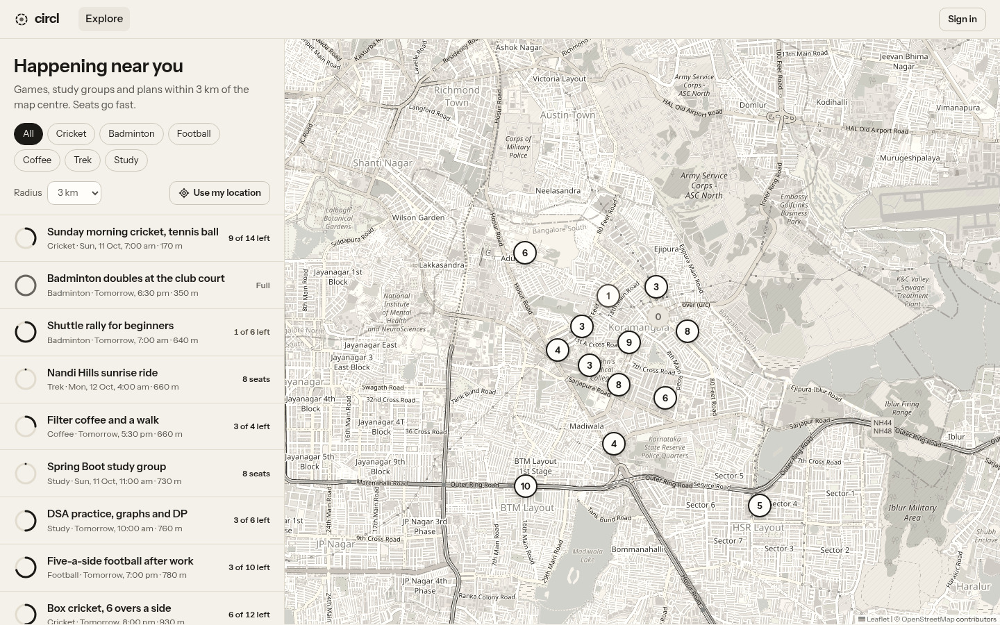

## Overview

Circl helps people do things together nearby. Anyone can host a small, time-boxed activity, such as a
badminton doubles game at 6:30, a five-a-side after work, a study group at the library cafe, a weekend
trek, or a coffee walk, with a place, a start time and a fixed number of seats. Others see what is on
around them on a map, sorted by distance and filterable by category, and join with one tap.

For participants: live seat counts, a waitlist that holds a freed seat for you for 15 minutes, group
bookings of up to four, in-app notifications and a reliability score that rewards showing up. For hosts:
a participant list, a rotating QR code for check-in at the venue, and a no-show process with appeals.
A "free now" status lets people say they are available for the next couple of hours without revealing
their exact location.

Under the hood it is a Spring Boot service on PostgreSQL + PostGIS, Redis and Apache Kafka, built with
production habits: correct seat accounting under concurrency, reliable event delivery through a
transactional outbox, idempotent consumers, and integration tests on real containers.

**Stack:** Java 21 · Spring Boot 3.5 · PostgreSQL 16 + PostGIS · Apache Kafka (KRaft) · Redis 7 · React 19 + Vite + Leaflet · Docker Compose · Testcontainers · GitHub Actions

## Contents

- [Key features](#key-features)
- [Screenshots](#screenshots)
- [Architecture](#architecture)
- [Engineering highlights](#engineering-highlights)
- [Performance](#performance)
- [Tech stack and rationale](#tech-stack-and-rationale)
- [Getting started](#getting-started)
- [Configuration](#configuration)
- [API reference](#api-reference)
- [Testing](#testing)
- [Project structure](#project-structure)
- [Roadmap](#roadmap)

## Key features

| Area | Capability |
|---|---|
| Discovery | Radius search with PostGIS (`ST_DWithin` + GiST index, KNN ordering by distance), category filters, Redis-cached results |
| Booking | One-tap joins, group bookings of up to 4 that succeed or wait together, safe retries with `Idempotency-Key` |
| Waitlist | Freed seats are held for the first party that fits, with a 15-minute claim window before moving on |
| Auditability | Append-only capacity ledger: `SUM(delta)` always equals `seats_taken` |
| Attendance | Rotating HMAC-signed QR check-in, an attendance state machine, no-show appeals within 48 hours |
| Trust | Per-user reliability score with an optional minimum score per activity |
| Presence | "Free now" status stored only in Redis with a TTL, location coarsened to about 1 km, rate-limited lookups |
| Events | Transactional outbox published to Kafka; idempotent consumers for notifications and live seat counts, dead-letter topic for poison messages |
| Real time | Live seat counts in the browser over Server-Sent Events |
| Security | BCrypt, 15-minute JWT access tokens, rotating refresh tokens in an `HttpOnly` cookie with reuse detection, login throttling, ownership checks |

## Screenshots

<table>
  <tr>
    <td>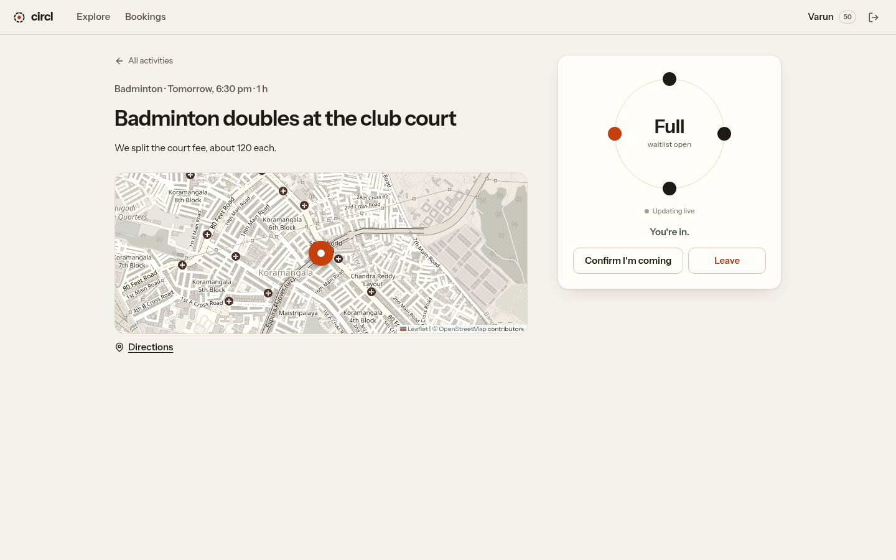</td>
    <td>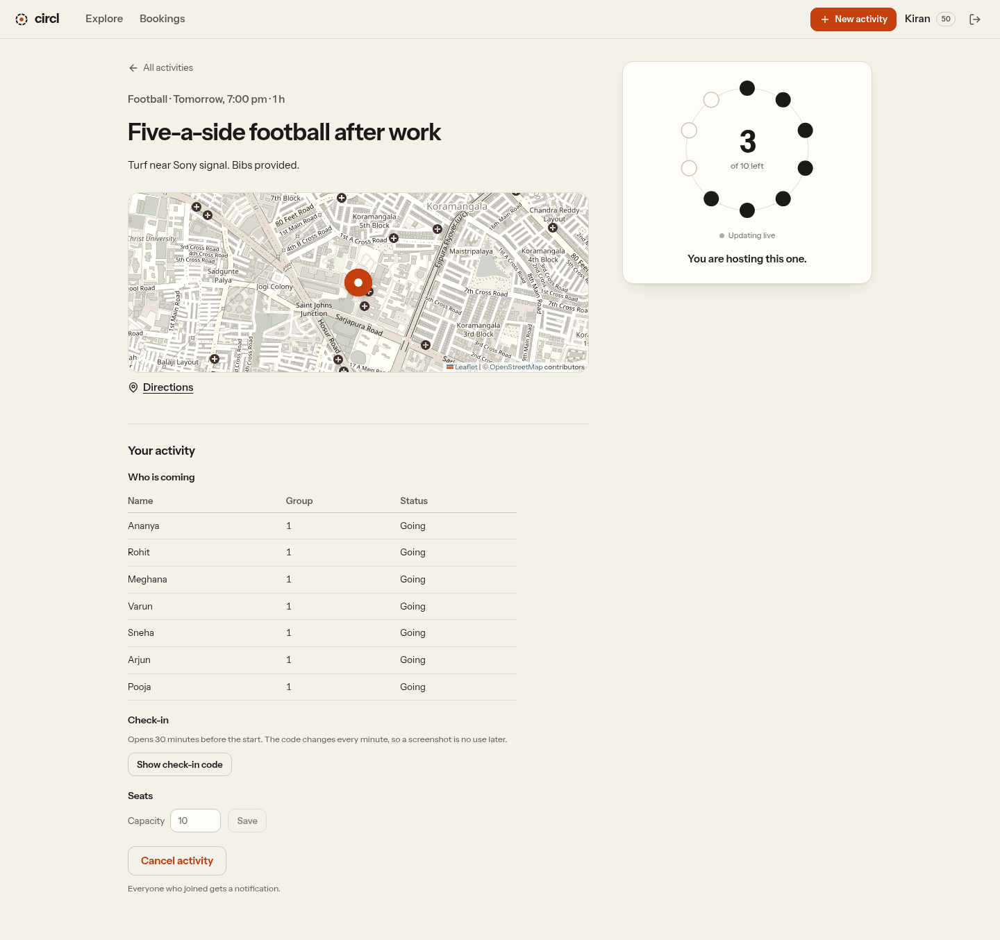</td>
  </tr>
  <tr>
    <td align="center">Activity page: one dot per seat, updated live</td>
    <td align="center">Host view: participants, rotating check-in QR, capacity</td>
  </tr>
  <tr>
    <td>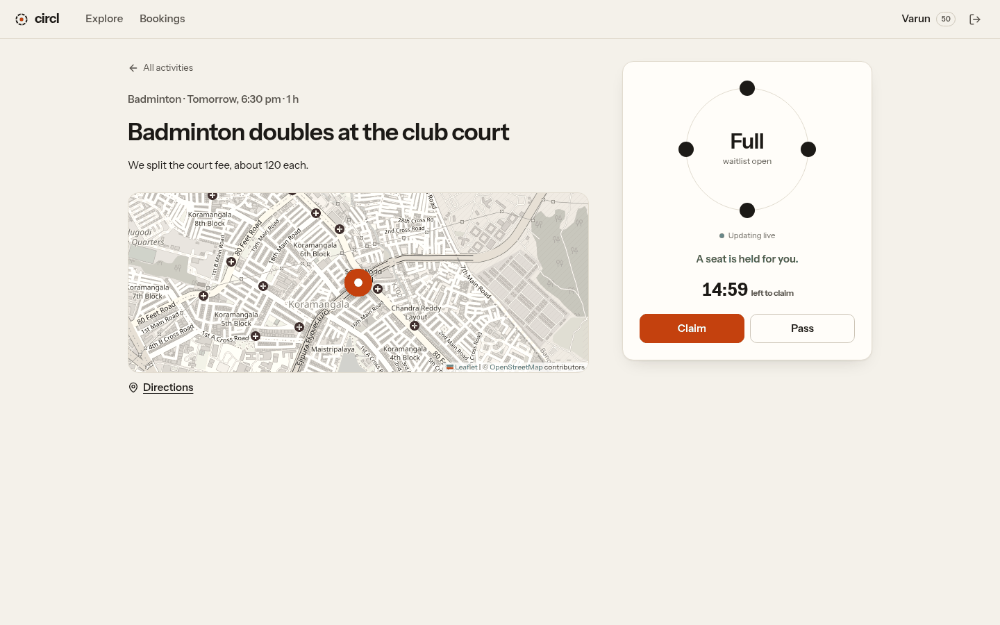</td>
    <td>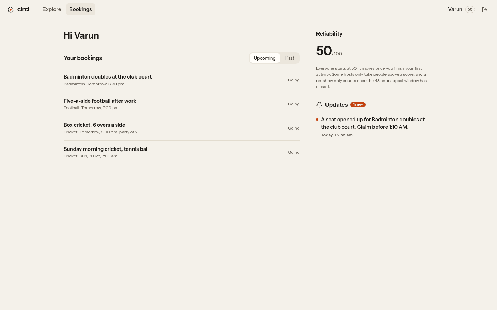</td>
  </tr>
  <tr>
    <td align="center">Waitlist offer with its claim deadline</td>
    <td align="center">Upcoming and past bookings</td>
  </tr>
</table>

## Architecture

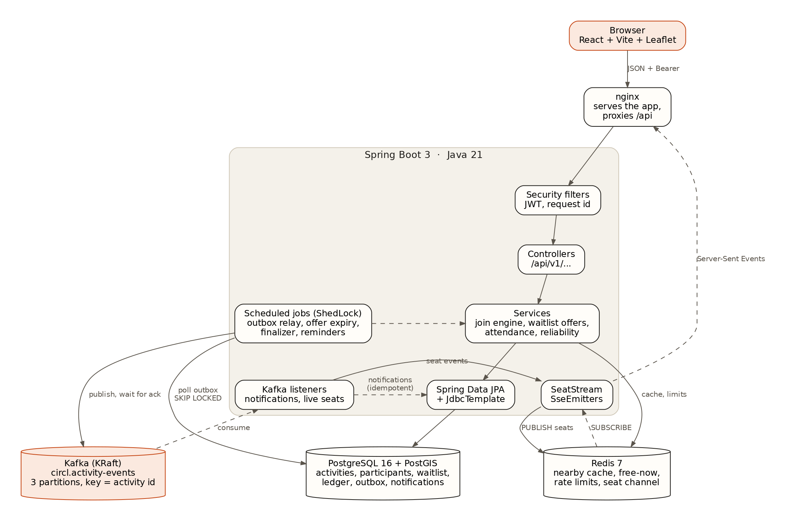

Circl is a modular monolith: one Spring Boot application organised by domain (`activity`, `participation`,
`attendance`, `identity`, `notification`, ...), each with the usual controller, service and repository layers.
Each backing service has a single, clearly bounded responsibility:

- **PostgreSQL + PostGIS** is the system of record: activities, seats, participants, the waitlist, the capacity ledger and the outbox. Invariants that must never break are enforced as database constraints.
- **Apache Kafka** carries domain events from the outbox to their consumers. It runs as a single KRaft node (no ZooKeeper) in Docker Compose and in tests.
- **Redis** holds data that is safe to lose: the nearby-search cache, free-now posts, rate-limit counters and the pub/sub channel that fans live seat counts out to every app instance. If Redis is unavailable, nearby search falls back to PostgreSQL and login fails closed with `503`.

Background work runs as `@Scheduled` jobs (outbox relay, offer expiry, attendance finalizer, reconfirm reminders),
coordinated across instances with ShedLock.

## Engineering highlights

### Join engine

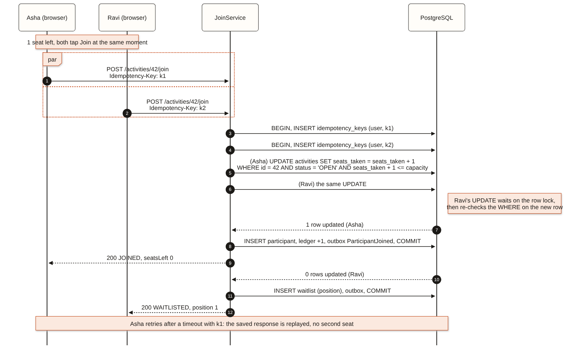

Seats are the one thing that must never be oversold when many people tap join at the same instant, so the seat check and the seat reservation are a single atomic statement:

```sql
UPDATE activities
   SET seats_taken = seats_taken + :party, version = version + 1
 WHERE id = :id AND status = 'OPEN'
   AND seats_taken + :party <= capacity;
```

PostgreSQL row-locks the activity for the first `UPDATE`; a concurrent one waits, then re-evaluates the
`WHERE` clause against the committed row. One request updates a row and is admitted, the other updates
none and is waitlisted. There is no read-then-write window for a race to exploit, and a
`CHECK (seats_taken <= capacity)` constraint backs it up.

- **Idempotency:** the `Idempotency-Key` row is written in the same transaction. A retry returns the stored response, a reused key with a different body is rejected, and a key still in flight returns `409`.
- **Strategy comparison:** pessimistic (`SELECT ... FOR UPDATE`) and optimistic (`@Version` with retries) implementations sit behind `CIRCL_JOIN_STRATEGY` and are exercised by the same race tests.
- **Seat simulator:** the [`seat-simulator`](seat-simulator) module reproduces the race in plain Java (`ExecutorService` + `CountDownLatch`). Without a lock, 100 threads booked 35 of 10 seats in one run; `synchronized`, `AtomicInteger` CAS and `ReentrantLock` all stop at exactly 10. Run it with `java -cp seat-simulator/target/classes com.darshan.circl.sim.SeatSimulator` after a build.

### Reliable events: transactional outbox and Kafka

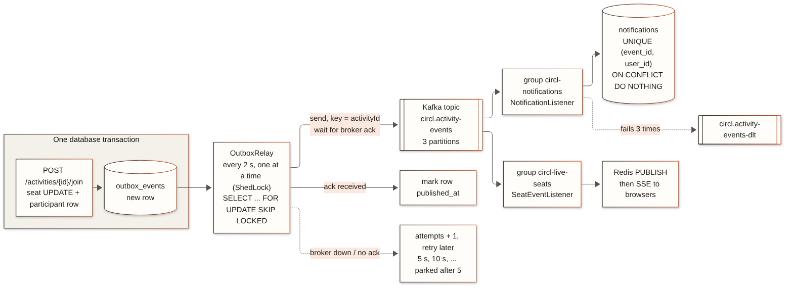

Writing to the database and publishing to a broker in the same request is a dual write: if either side fails,
the two disagree (a seat is taken but nobody is told, or a notification goes out for a rolled-back join).
Circl avoids this with the transactional outbox pattern:

1. The business change and an `outbox_events` row commit in **one database transaction**.
2. `OutboxRelay` polls pending rows every 2 seconds (`FOR UPDATE SKIP LOCKED`, one relay at a time via ShedLock) and publishes each to the `circl.activity-events` topic, **keyed by activity id**, so all events for one activity land on one partition in order.
3. A row is marked published **only after the broker acknowledges** it (`acks=all`). If Kafka is down, the row stays in the outbox and is retried with backoff (5 s, 10 s, ...) and parked after 5 attempts.
4. Two consumer groups read the topic independently: `circl-notifications` writes in-app notifications, `circl-live-seats` pushes fresh seat counts to browsers.

Delivery is **at least once**: a crash between the broker ack and the database commit republishes an event.
Consumers are therefore idempotent. Notifications are inserted with `ON CONFLICT (event_id, user_id) DO NOTHING`,
and a repeated seat event just re-sends the current count. A record that keeps failing is retried three times
and then moved to `circl.activity-events-dlt`, so it cannot block its partition.

### Waitlist with time-boxed offers

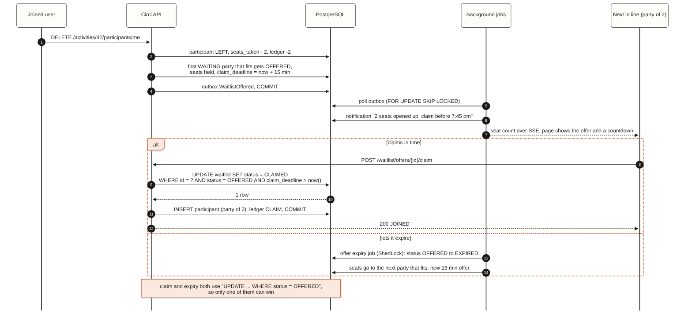

When seats free up, the first waiting party that fits receives an offer and the seats are held for 15 minutes.
A party of three that does not fit keeps its position, while a single person behind it can take one free seat.
Claim and expiry both run `UPDATE ... WHERE status = 'OFFERED'`, so whichever arrives first wins and the other is a no-op.

### Authentication and token rotation

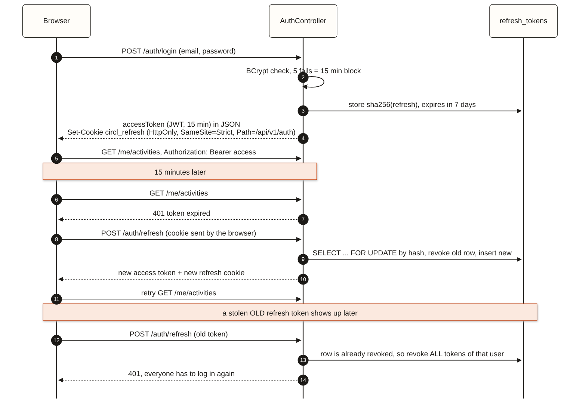

- **Access token:** HS256 JWT, valid for 15 minutes, held only in memory by the browser.
- **Refresh token:** random, valid for 7 days, stored as a SHA-256 hash and delivered as an `HttpOnly`, `SameSite=Strict` cookie scoped to `/api/v1/auth`. API clients may send it in the request body instead.
- **Rotation with reuse detection:** every refresh issues a new token. Presenting a token that was already rotated revokes all of the user's sessions.
- **Throttling:** five failed logins block the email for 15 minutes (counted in Redis).

### Attendance and reliability

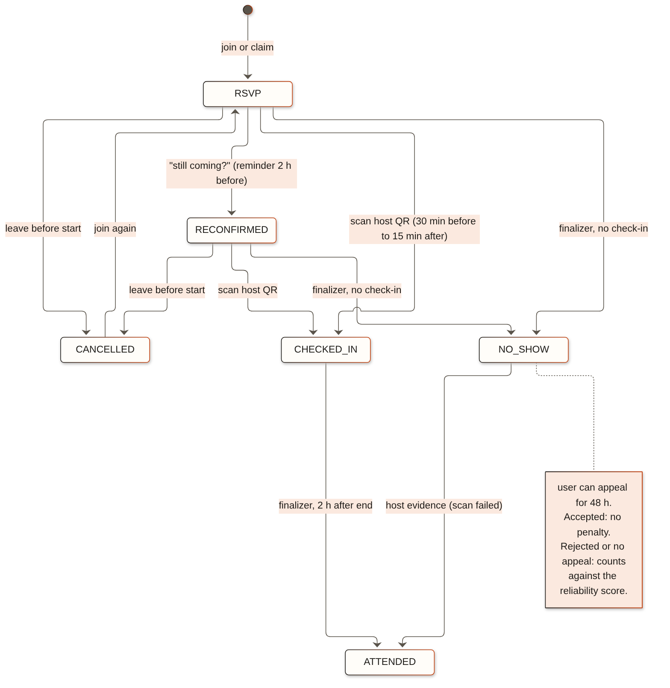

The host displays a QR code that rotates every 60 seconds (an HMAC-signed token). Two hours after an activity ends,
a finalizer marks everyone who did not check in as `NO_SHOW`; the participant then has 48 hours to appeal,
and only a rejected or missing appeal counts against them. Hosts can mark check-in as unreliable for an
activity, in which case nobody is penalised.

```
score = (checked_in + 1) / (committed + 2) * 100
```

Laplace smoothing starts new users at 50 and keeps a single missed event from dominating the score.

### Live seat count

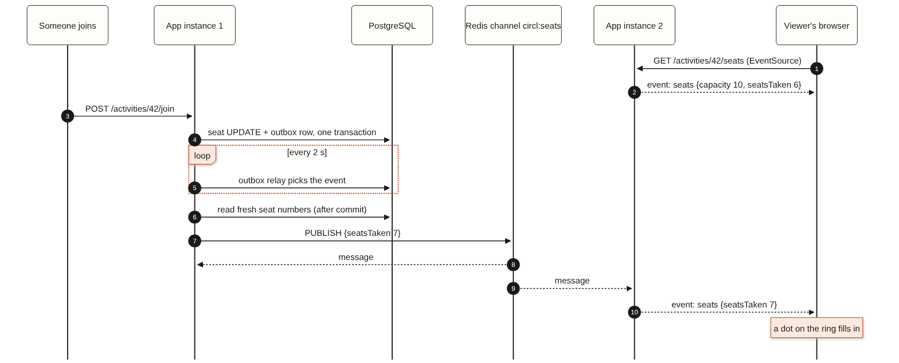

The activity page subscribes to `/api/v1/activities/{id}/seats` with `EventSource`. The `circl-live-seats`
consumer reads the committed seat numbers and publishes them on a Redis channel; every app instance forwards
them to its connected browsers. A 25-second heartbeat keeps proxies from closing idle streams.

### Data model

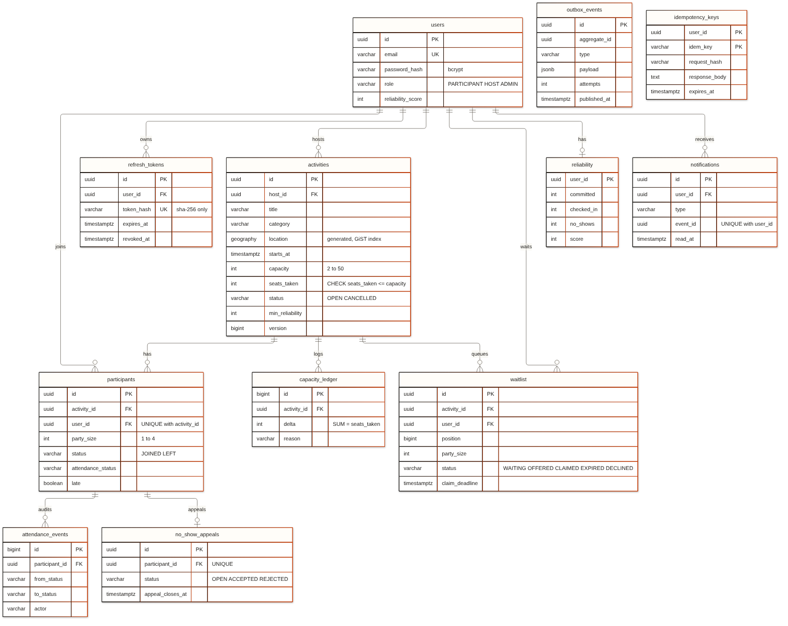

| Invariant | Enforcement |
|---|---|
| Seats taken never exceed capacity | `CHECK (seats_taken >= 0 AND seats_taken <= capacity)` |
| A user joins an activity at most once | `UNIQUE (activity_id, user_id)` on participants and waitlist |
| A retried request takes effect once | primary key `(user_id, idem_key)` on `idempotency_keys` |
| One notification per event per user | `UNIQUE (event_id, user_id)`, also what makes the Kafka consumer idempotent |
| One appeal per no-show | `UNIQUE (participant_id)` on `no_show_appeals` |
| Coordinates and geography always agree | `location` is a generated column from `latitude` and `longitude` |

The schema is managed by Flyway migrations (`V1` to `V7`); Hibernate only validates it.

## Performance

Measured on a single 4-CPU machine running the application, database and load generator together.
Treat these as relative comparisons rather than production figures.

| Scenario | Result |
|---|---|
| Nearby search, 100k activities, 3 km radius | 72 to 85 ms without an index; about **8 ms** with a GiST index and KNN ordering |
| Nearby search under load (k6, 50 virtual users, 30 s) | uncached: p95 363 ms, 294 req/s; Redis-cached: **p95 34 ms, 3014 req/s**, 0 errors |
| 60 concurrent HTTP joins for 10 seats | 10 joined, 50 waitlisted, 0 overbooked |
| 50 threads racing for the last seat, 20 rounds per strategy | conditional update p50 85 ms, pessimistic 96 ms, optimistic 57 ms with 143 retries; 0 overbooked in all three |
| 10 parallel requests sharing one `Idempotency-Key` | 1 participant row, 1 seat taken |
| Seat simulator, 100 threads, 10 seats, no lock | 35 booked, 25 overbooked (varies per run) |
| Join to live seat update in the browser (through Kafka and nginx) | 1.1 to 1.8 s, median 1.2 s over 7 joins; most of it is the 2 s outbox poll |
| Kafka stopped during a leave, then restarted | the event stayed in the outbox and was delivered 6 s after the broker came back |

## Tech stack and rationale

| Concern | Choice | Rationale | Alternative considered |
|---|---|---|---|
| Language and framework | Java 21, Spring Boot 3.5 | mature ecosystem, records, strong typing for rule-heavy domain code | Node.js: weaker typing for this domain |
| Database | PostgreSQL 16 + PostGIS | transactions, row locks, `CHECK` constraints, real spatial indexes | MongoDB: multi-document transactions are a poor fit for seat accounting |
| Seat safety | conditional `UPDATE` | one round trip, no retry loop, the database re-checks the condition | `synchronized`: only protects a single JVM |
| Geo search | `ST_DWithin` + GiST + `<->` | index-backed, ordered by true distance | Haversine in SQL: full table scan |
| Events | transactional outbox + Apache Kafka | no lost or phantom events, ordered per activity, independent consumer groups, replayable | direct publish from the request: dual write; RabbitMQ: classic queues drop messages once consumed, so no replay or per-key partition ordering |
| Cache, presence, limits | Redis | TTLs, GEO commands, atomic counters | in-process maps: break with more than one instance |
| Live updates | Server-Sent Events | one-way push over plain HTTP with automatic reconnect | WebSocket: bidirectional channel not needed; polling: wasteful |
| Auth | JWT access + rotating refresh tokens | stateless API with revocable sessions | server sessions: need sticky sessions or a session store |
| Testing | JUnit 5 + Testcontainers | real PostgreSQL/PostGIS, Redis and Kafka in every integration test | H2 / embedded brokers: different SQL, locking and delivery behaviour |
| Frontend | React + Vite + Leaflet | lightweight SPA, fast builds, free map tiles | Next.js: server rendering not required |

## Getting started

### Prerequisites

- **Docker** (Docker Desktop on Windows and macOS). This is all you need to run the full stack.
- For development mode and running tests: **JDK 21** and **Node.js 22**.

### Quick start (Docker)

```bash
git clone https://github.com/Darshan-dev57/Circl.git
cd Circl
docker compose --profile app up -d --build
```

| Service | URL |
|---|---|
| Web app | http://localhost:3000 |
| REST API | http://localhost:8080 |
| Swagger UI | http://localhost:8080/swagger-ui.html |
| Kafka (from the host) | `localhost:9092` |

Load demo activities around Koramangala, Bengaluru:

```bash
docker exec -i circl-postgres psql -U circl -d circl < scripts/demo_data.sql
```

Sign in as the demo host `demo.host@circl.dev` / `circl-demo-pass`, or create an account.

> [!NOTE]
> The first build downloads the base images and dependencies and takes a few minutes (about 2 minutes on the test machine). The backend waits for PostgreSQL, Redis and Kafka to report healthy before it starts.

### Development mode

```bash
docker compose up -d                        # PostgreSQL, Redis and Kafka only
./mvnw -pl backend spring-boot:run          # API on :8080
cd frontend && npm install && npm run dev   # app on :5173, /api proxied to :8080
```

### Windows (PowerShell)

Start Docker Desktop (WSL 2 backend) and wait for "Engine running". Run each line separately:

```powershell
git clone https://github.com/Darshan-dev57/Circl.git
cd Circl
docker compose --profile app up -d --build
Get-Content scripts\demo_data.sql | docker exec -i circl-postgres psql -U circl -d circl
```

Development mode, with the frontend in a second PowerShell window:

```powershell
docker compose up -d
.\mvnw.cmd -pl backend spring-boot:run
```

```powershell
cd frontend
npm install
npm run dev
```

Run the tests with `.\mvnw.cmd verify` while Docker Desktop is running.

> [!TIP]
> - PowerShell has no `<` redirect, so the SQL file is piped in with `Get-Content`.
> - Windows PowerShell 5.1 does not support `&&`; run commands on separate lines as shown.
> - `mvnw.cmd` requires JDK 21 (`java -version`). If Maven picks up another JDK, point `JAVA_HOME` at JDK 21.
> - If port 5432, 6379, 9092, 8080 or 3000 is taken (commonly a local PostgreSQL on 5432), stop that service or change the host side of the mapping in `docker-compose.yml`, for example `"5433:5432"`, and in development mode set `$env:DB_URL="jdbc:postgresql://localhost:5433/circl"`.
> - `.gitattributes` keeps `mvnw` as LF and `mvnw.cmd` as CRLF, so default Git for Windows settings work.

## Configuration

All settings are read from environment variables. For Docker Compose, copy `.env.example` to `.env`.

| Variable | Default | Description |
|---|---|---|
| `DB_URL`, `DB_USER`, `DB_PASSWORD` | local Compose values | PostgreSQL connection |
| `REDIS_HOST`, `REDIS_PORT` | `localhost`, `6379` | Redis connection |
| `KAFKA_BOOTSTRAP_SERVERS` | `localhost:9092` | Kafka brokers (`kafka:19092` inside Compose) |
| `CIRCL_JWT_SECRET` | development-only value | JWT signing key; use 32+ random characters outside local development |
| `CIRCL_CHECKIN_SECRET` | development-only value | signs check-in QR codes |
| `COOKIE_SECURE` | `false` | set to `true` when served over HTTPS |
| `CIRCL_JOIN_STRATEGY` | `CONDITIONAL_UPDATE` | `PESSIMISTIC` or `OPTIMISTIC` for comparison |
| `CACHE_TYPE` | `redis` | `none` disables the nearby-search cache |
| `CORS_ORIGINS` | `http://localhost:5173` | browser origins allowed to call the API directly |
| `PORT` | `8080` | HTTP port |

> [!IMPORTANT]
> The defaults for `CIRCL_JWT_SECRET` and `CIRCL_CHECKIN_SECRET` are for local development only. No real secret is committed to this repository.

## API reference

All endpoints are under `/api/v1`. Errors follow [RFC 9457 Problem Details](https://www.rfc-editor.org/rfc/rfc9457),
including field-level errors for validation failures. Interactive documentation is served by Swagger UI, and a
Postman collection is available in [`docs/postman`](docs/postman/circl.postman_collection.json); run it top to bottom
(offer, check-in and appeal requests need an activity that is full, about to start or finished).

<details>
<summary>Endpoint list (34 endpoints)</summary>

| Method | Path | Access | Description |
|---|---|---|---|
| POST | `/auth/signup` | anyone | create an account (role `PARTICIPANT` or `HOST`) |
| POST | `/auth/login` | anyone | tokens + refresh cookie |
| POST | `/auth/refresh` | anyone | rotate the refresh token, new access token |
| POST | `/auth/logout` | anyone | revoke the refresh token |
| GET | `/me` | user | my profile and score |
| POST | `/activities` | host | create an activity |
| GET | `/activities` | anyone | upcoming activities, paged |
| GET | `/activities/nearby?lat&lng&radiusKm&category` | anyone | nearby, sorted by distance |
| GET | `/activities/{id}` | anyone | activity details |
| PATCH | `/activities/{id}` | owner | update title, time, capacity and other fields |
| DELETE | `/activities/{id}` | owner | cancel; every participant is notified |
| GET | `/activities/{id}/seats` | anyone | live seat count (Server-Sent Events) |
| POST | `/activities/{id}/join` | user | join or get waitlisted, needs `Idempotency-Key` |
| DELETE | `/activities/{id}/participants/me` | user | leave or leave the waitlist |
| GET | `/activities/{id}/participants/me` | user | my status: joined, waitlisted (position), offered |
| GET | `/activities/{id}/participants` | owner | participant list |
| GET | `/me/activities?when=upcoming\|past&cursor` | user | my bookings, keyset paged |
| GET | `/me/hosting` | host | activities I host |
| GET | `/me/offers` | user | open waitlist offers |
| POST | `/waitlist/offers/{id}/claim` | user | claim held seats |
| POST | `/waitlist/offers/{id}/decline` | user | decline, passing the seats to the next party |
| POST | `/activities/{id}/confirm` | user | reconfirm attendance |
| GET | `/activities/{id}/checkin-code` | owner | current QR code (60 s) |
| POST | `/activities/{id}/checkin` | user | check in with the code |
| POST | `/activities/{id}/attendance/{userId}/evidence` | owner | fix a failed scan |
| POST | `/activities/{id}/attendance/unreliable` | owner | check-in was down, no penalties |
| POST | `/me/attendance/{participantId}/appeal` | user | appeal a no-show (48 h) |
| POST | `/appeals/{id}/decision` | owner | accept or reject an appeal |
| GET | `/me/reliability` | user | score breakdown |
| POST | `/availability` | user | free now, for 15 to 180 minutes |
| GET | `/availability/nearby` | user | who is free nearby (rounded distance) |
| DELETE | `/availability/me` | user | clear free-now status |
| GET | `/me/notifications` | user | latest notifications |
| POST | `/me/notifications/{id}/read` | user | mark as read |

</details>

## Testing

```bash
./mvnw verify                                  # unit + integration tests (requires Docker)
cd frontend && npm run lint && npm run build
```

**133 tests:** 9 for the seat simulator, 32 unit tests and 92 integration tests. Integration tests run
against real PostgreSQL + PostGIS, Redis and Kafka containers started by Testcontainers.

Coverage includes 60 parallel HTTP joins for 10 seats, last-seat races under each locking strategy, idempotent
replays, waitlist offers racing with cancellations, refresh token reuse, check-in windows and appeals, free-now
privacy rules, the outbox-to-Kafka round trip, duplicate delivery producing exactly one notification, broker
outages leaving events in the outbox, dead-letter routing, and the live seat stream. GitHub Actions runs the full
suite on every push.

## Project structure

```
Circl
├── backend/                     Spring Boot API
│   └── src/main/java/com/darshan/circl
│       ├── activity/            activities, nearby search, live seat stream
│       ├── participation/       join engine, waitlist, offers, idempotency, ledger, my bookings
│       ├── attendance/          check-in, state machine, finalizer, appeals, reminders
│       ├── reliability/         score
│       ├── availability/        free now (Redis)
│       ├── identity/            signup, login, JWT, refresh tokens
│       ├── notification/        in-app notifications (Kafka consumer)
│       ├── common/              errors, outbox + Kafka relay, paging, request id
│       └── config/              security, cache, scheduling, Kafka, OpenAPI
├── frontend/                    React + Vite + Leaflet
├── seat-simulator/              the race condition in plain Java
├── load/                        k6 script for nearby search
├── scripts/                     demo data and a 100k seed
├── docs/                        diagrams (sources + PNG), screenshots, Postman collection
├── docker-compose.yml
└── .github/workflows/ci.yml
```

## Roadmap

- Web push notifications as an additional Kafka consumer
- Appeal review screen for hosts (the API exists)
- Recurring activities, for example every Sunday at 7 am
- Activity chat
- Public deployment with managed PostgreSQL and Kafka

---

Released under the [MIT License](LICENSE). See the [changelog](CHANGELOG.md) for release history.
